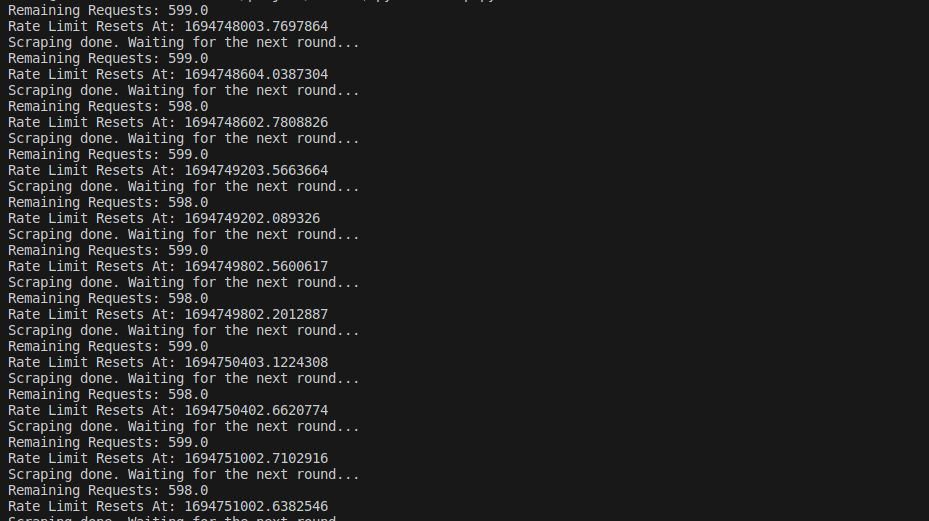
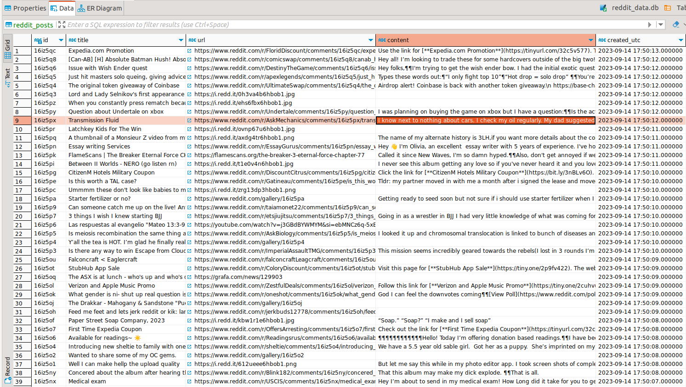

# Reddit Scraping for Subnet Miner

## Introduction

This repository provides tools for scraping data from Reddit. The scraped results are saved into a local SQLite database named `reddit_data.db`.

## Prerequisites

- **Python Version**: Ensure you have Python version 3.7 or higher installed on your machine. You can verify this with the command `python --version`.
- **Git**: Ensure you have Git installed. This is required to clone the repository.

## Setup & Installation

1. **Clone the Repository**: 
   ```bash
   git clone git@github.com:gitphantomman/reddit_scraping_for_miner.git
   ```

2. **Navigate to the Directory**: 
   ```bash
   cd path/reddit_scraping_for_miner
   ```

3. **Install Dependencies**:
   ```bash
   pip install -r requirements.txt
   ```

## Running the Script

1. Start the scraping process with:
   ```bash
   python scrap.py
   ```

2. Upon completion, the scraped results will be saved into an SQLite database file named `reddit_data.db`.

3. To view the results, use a database management tool such as `dbeaver-ce`.

---

